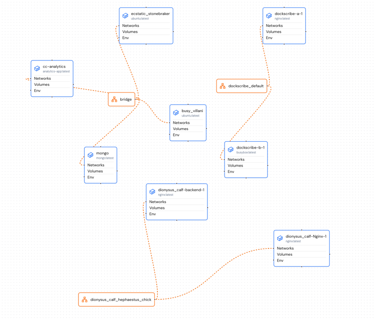

# Dockscribe

This is a command line tool to produce a visual map of any docker infrastructure from cmd line.
This tool require an account on composecraft.com to be used, it's open source for security reason.

# Get started

## Installation

```bash
pip install dockscribe
```

## Requirements

While running the tool, you need to use a user that can call docker cmd like (without sudo):

```bash
docker run --rm hello-world
```

[this doc](https://docs.docker.com/engine/install/linux-postinstall/) might help you learn how to use docker without sudo.


## Usage

The first thing, is to log in to your composecraft.com account ;

```bash
dockscribe login
```

Then :

```bash
dockscribe describe
```



This command will produce you a visual map of your current docker infrastructure.
You can also view a compose file with :

```bash
dockscribe describe --filename=./pathToDockerCompose.yaml
```

You can also directly analyse from an url : 

```bash
dockscribe describe --filename=https://yourdockercompose.com/yamlfile.yaml
```

In case of help, you can call any cmd with `--help`

```bash
dockscribe --help
```
